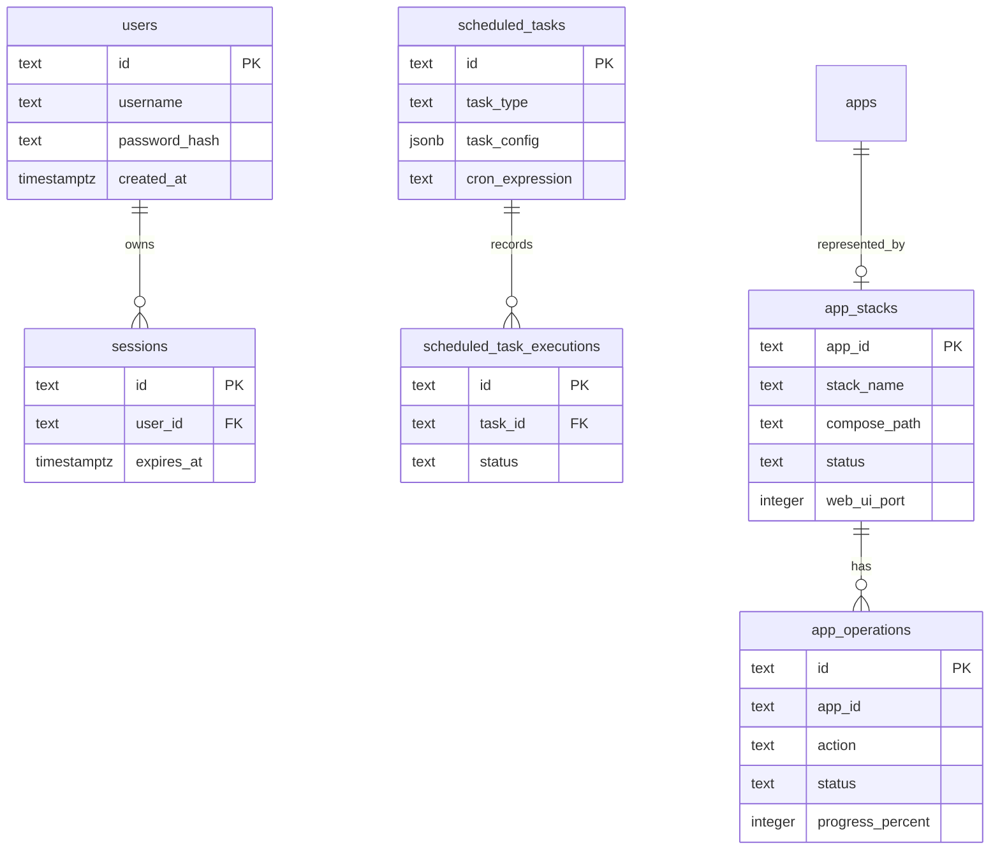

# Database

Homeio uses PostgreSQL with Drizzle ORM. The schema lives in `lib/server/db/schema.ts`; migrations live in `drizzle/`.

## Tables

| Table | Columns | Indexes / relationships |
|---|---|---|
| `apps` | `id text pk`, `name text`, `status text default unknown`, `updated_at timestamptz default now` | `apps_name_idx` |
| `users` | `id text pk`, `username text unique`, `password_hash text`, `created_at timestamptz` | `users_username_idx` |
| `sessions` | `id text pk`, `user_id text`, `expires_at timestamptz`, `created_at timestamptz` | `user_id -> users.id cascade`, `sessions_user_id_idx`, `sessions_expires_at_idx` |
| `app_stacks` | `app_id text pk`, `template_name`, `stack_name`, `compose_path`, `status`, `web_ui_port`, `env_json jsonb`, `display_name`, `icon_url`, `installed_at`, `updated_at`, `is_up_to_date`, `last_update_check`, `local_digest`, `remote_digest` | `app_stacks_status_idx`, `app_stacks_web_ui_port_idx` |
| `app_operations` | `id text pk`, `app_id`, `action`, `status`, `progress_percent`, `current_step`, `error_message`, `started_at`, `finished_at`, `updated_at` | `app_operations_app_id_idx`, `app_operations_status_idx`, `app_operations_updated_at_idx` |
| `custom_store_apps` | `app_id text pk`, `name`, `icon_url`, `web_ui_url`, `source_type`, `source_text`, `compose_content`, `repository_url`, `created_at`, `updated_at` | `custom_store_apps_updated_at_idx` |
| `files_network_shares` | `id text pk`, `host`, `share`, `username`, encrypted password fields, `mount_path`, `created_at`, `updated_at` | unique `mount_path`, `created_at` index |
| `files_local_shares` | `id text pk`, `share_name`, `source_path`, `shared_path`, `created_at`, `updated_at` | unique share/source/shared path indexes |
| `notifications` | `id text pk`, `title`, `body`, `kind default info`, `read default false`, `created_at` | `notifications_created_at_idx` |
| `scheduled_tasks` | `id text pk`, `label`, `task_type`, `task_config jsonb`, `cron_expression`, `enabled`, `last_run_at`, `last_run_status`, `last_run_output`, `next_run_at`, `created_at`, `updated_at` | `scheduled_tasks_next_run_at_idx` |
| `scheduled_task_executions` | `id text pk`, `task_id`, `status`, `output`, `started_at`, `duration_ms` | `task_id -> scheduled_tasks.id cascade`, task and started indexes |
| `settings` | `id text pk default singleton`, `appearance_json jsonb`, encrypted Google OAuth client secret fields, `google_client_id`, `google_redirect_uri`, `updated_at` | singleton row pattern |
| `files_google_drive_tokens` | `id text pk`, `email unique`, `display_name`, encrypted access/refresh token fields, `expires_at`, `created_at`, `updated_at` | unique email, created index |
| `files_trash_entries` | `id text pk`, `trash_path`, `original_path`, `deleted_at` | unique trash path, deleted index |

## ER Diagram



Drizzle does not declare a foreign key from `app_operations.app_id` to `app_stacks.app_id`; the relationship is logical in repository/service code.

## Migration Workflow

Use this sequence for schema changes:

```bash
npm run db:generate
npm run db:migrate
npm run db:init
```

`npm run db:generate` runs `drizzle-kit generate` and creates SQL in `drizzle/`.

`npm run db:migrate` runs `drizzle-kit migrate` and applies pending migrations.

`npm run db:init` runs `scripts/db-migrate.ts`. Per the audit, it drops `drizzle.__drizzle_migrations` before rerunning migrations. Use it for local initialization, not as a casual migration-history-preserving command.

`npm run db:reset` runs `scripts/db-reset.ts` and is destructive.

## Migrations in the container

The Docker entrypoint runs `dist-server/scripts/db-migrate.js` — the compiled
`scripts/db-migrate.ts` — before starting the server. It applies the versioned
SQL in `drizzle/` through the migrator that ships inside `drizzle-orm`.

It used to run `drizzle-kit push`, which diffed `schema.ts` against the live
database and applied whatever it found. That hid a class of mistake: a
migration file that never made it into `drizzle/meta/_journal.json` still took
effect, because push created the table from the schema regardless.
`0004_task_executions.sql` sat outside the journal that way for months, and the
switch to the migrator is what surfaced it.

So: **a migration file is only real once it is in the journal.** `drizzle-kit
generate` adds the entry for you; a hand-written SQL file needs the entry added
by hand. To check for drift, apply the migrations to an empty database and then
run `npx drizzle-kit push` against it — anything other than `No changes
detected` means the migrations no longer reproduce the schema.

## Drizzle Patterns

- Schema is centralized in `lib/server/db/schema.ts`.
- Database client helpers live in `lib/server/db/drizzle.ts`, `lib/server/db/postgres.ts`, and `lib/server/db/query.ts`.
- Repository functions live under owning server modules, for example `lib/server/modules/apps/stacks-repository.ts` and `lib/server/modules/files/network-shares-repository.ts`.
- JSON settings use `jsonb` fields such as `settings.appearance_json`, `app_stacks.env_json`, and `scheduled_tasks.task_config`.
- Google Drive OAuth app credentials are stored on the singleton `settings` row. The client secret uses the same ciphertext/IV/tag pattern as other encrypted file credentials; connected account tokens live separately in `files_google_drive_tokens`.
- The current codebase uses standard Drizzle query builders; no prepared-statement convention was found in the audited files.
